# Sagittarius Archery Tracker

**Sagittarius** is a prototype archery scorecard and shot-analysis app for plotting arrows, reviewing practice sessions, tracking records, and exporting clean target images.

It is designed for target archery practice: create a scorecard, plot arrows directly on a target face, review your ends, and use analysis tools to understand how your session performed.

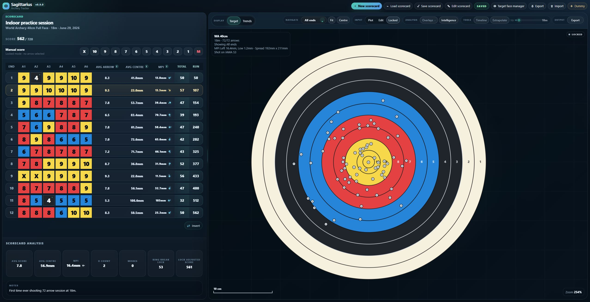

## Highlights

- Plot arrows directly onto archery target faces.
- Score full practice sessions with automatic scoring from plotted arrow positions.
- Review scorecard stats including total score, average arrow, X count, misses, average centre, MPI, Ring Break Luck, and Luck Adjusted Score.
- Use analysis overlays for labels, dispersion, enclosing group, Shot Pattern DNA, and Ring Break Luck.
- Run Performance Intelligence to compare your actual score against a 5,000-run Monte Carlo simulation of your plotted shot pattern.
- Replay sessions with Timeline mode.
- Extrapolate a plotted group to different distances.
- Temporarily compare a session against another target face with Target swap, without changing saved records or PB categories.
- Manage saved scorecards through a calendar-assisted **Scorecard manager** that highlights days with saved sessions and shows compact visual session cards.
- Track trends, records, and arrows shot across saved scorecards.
- Export scorecards as JSON and export clean target images for sharing or coaching.
- Create and edit custom target faces, which is a major focus of the app and something many archery scorecard apps do not allow.
- On laptop-width viewports, the viewport toolbar can collapse into a slim handle and reveal wrapped controls on hover to protect target space.
- On narrow score panels, the scorecard keeps stable columns, uses horizontal scrolling, pins Total/Run over a clean panel-coloured edge mask, preserves Avg Arrow, Avg Centre, and MPI, and keeps Invert fixed to the visible scorecard pane.
- The scorecard/target workspace preserves its current proportional split when the browser window is resized; the default scorecard share is 35%, and dragging the divider reveals more columns without changing table density.

## Quick start

Sagittarius is currently **prototype software**. At this stage it can be run in two simple ways:

1. **Locally as a basic web app** - download or clone the project and open `index.html` in a modern browser.
2. **Via GitHub Pages / live GitHub hosting** - if the repository is hosted with GitHub Pages enabled, the app can be opened directly in the browser from the hosted site.

No account, server, or build step is required for the current prototype. Scorecards can be saved locally inside the browser and exported/imported as JSON files so your practice data remains portable.

In the future, the intended delivery may change. The likely direction is a standalone desktop app for the full experience, with a lighter mobile version for more basic score entry and review.

## Scorecards

Target faces define the geometry and scoring zones of the target. They do **not** lock the scorecard to a specific distance: you can use any target face at any distance, and changing the target face will not overwrite the distance you selected.

The scorecard panel is the main session view. It shows the scorecard title and session details, a minimal score line, individual end rows, and a **Scorecard analysis** section underneath. The scorecard uses a scorecard-first scroll flow: long scorecards show their rows before the analysis and notes sections so smaller laptop screens prioritise the actual scoring table. On narrower laptop layouts, non-essential manual-score copy is hidden, manual score buttons wrap into a clean 6 x 2 grid, analysis metric cards wrap into clean equal-width grids, and the scorecard table keeps Avg Arrow / Avg Centre / MPI available through horizontal scroll while sticky Total and Run remain visible. The middle divider stores the scorecard/target allocation as a percentage, so resizing the browser preserves the chosen split instead of keeping a stale pixel width. Table density follows the browser width, while divider movement only reveals more or fewer columns.

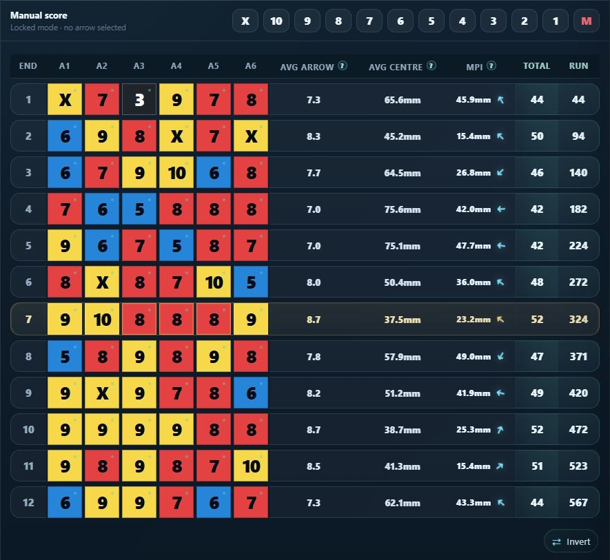

The scorecard supports both plotted and manual scoring. Plotted arrows are scored from their target position, while manual scores can be used when you want to record a score without placing an arrow on the target.

The scorecard view includes practical session stats such as:

- **Total score** - the current score for the scorecard.
- **Average arrow** - the average score per recorded arrow.
- **X count** - the number of X-ring hits where supported by the target face.
- **Misses** - recorded misses for the session.
- **Average centre** - the average plotted-arrow distance from the target centre.
- **MPI** - mean point of impact, showing how far the group centre is from the middle.
- **Ring Break Luck** - whether close line decisions were mostly lucky or unlucky.
- **Luck Adjusted Score** - an estimate of what the score would look like with neutral ring-break luck.

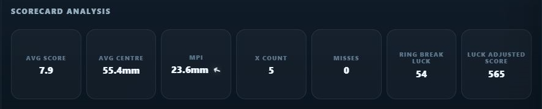

When a completed scorecard is your best result for a matching target face, distance, arrow count, and possible score, Sagittarius shows a **PB** indicator.

## Saved scorecard calendar

The **Scorecard manager** includes a custom calendar alongside the saved-scorecard list. Days with saved scorecards are subtly highlighted, days with multiple scorecards show a compact count marker, and the calendar only shows dates from the active month. Each saved entry uses a compact visual summary card for the scorecard/target face, distance, and arrows, with date, time, and score shown separately, plus a top-right action strip with compact icon buttons for duplicate, export, and delete.

Selecting a date does not immediately open a scorecard. Instead, the saved-scorecard list jumps to that date group so you can review and choose the exact session, which is especially useful when you have multiple scorecards on the same day.

## Plotting arrows

Use the target viewport to plot arrows directly onto the target face. The app stores plotted arrow positions in real target-face measurements, which means the scorecard can be re-rendered, analysed, exported, and compared reliably.

The viewport toolbar includes controls for plotting, editing, locking, fitting the target to view, centring the target, filtering by end, opening analysis tools, exporting images, entering Timeline mode, using distance extrapolation, and temporarily changing the viewed target with **Target swap**.

## Viewport overlays

Overlays help you inspect different parts of your shooting session without changing the underlying scorecard.

### Arrow labels

The labels overlay shows arrow numbering directly on the target, making it easier to connect plotted arrows with scorecard rows and review specific shots.

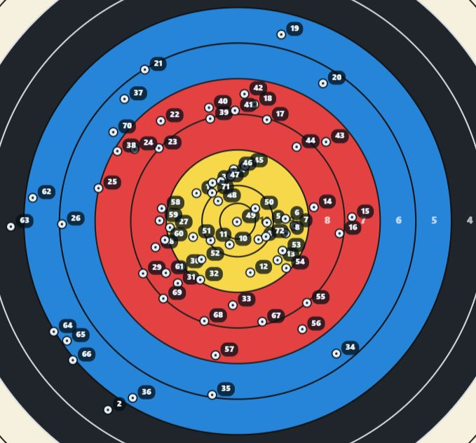

### Dispersion and enclosing group

**Dispersion** helps show how widely the arrows are spread around the group. It gives a quick visual sense of whether the session was tight, loose, vertical, horizontal, or uneven.

**Enclosing group** shows the smallest simple circle that contains the plotted group. This is useful as an easy-to-understand group-size reference: if the enclosing circle shrinks over time, your plotted group is becoming tighter.

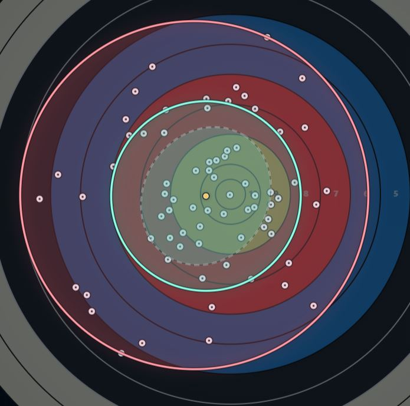

These overlays are useful for coaching and review because they focus on grouping rather than just score. Two scorecards can have similar scores but very different group shapes.

### Shot Pattern DNA

**Shot Pattern DNA** is a deeper group analysis overlay. It looks at the actual plotted arrow positions and summarises the pattern of the session.

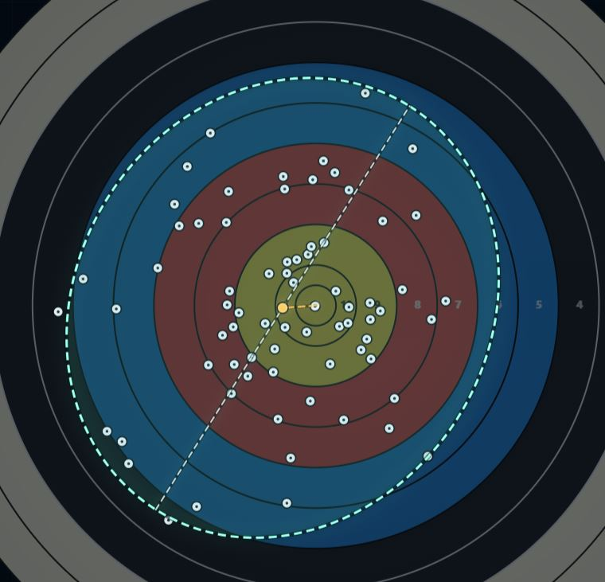

Shot Pattern DNA can help identify things such as:

- where the group centre is sitting,
- whether the group is offset from the middle,
- whether the group is wider horizontally or vertically,
- the likely shape and angle of the group,
- and which arrows behave like major outliers.

This is the same type of information used by the Performance Intelligence modal to simulate likely repeat outcomes from the plotted pattern.

### Ring Break Luck overlay

Ring Break Luck highlights arrows near scoring boundaries. Green arrows represent lucky line-cutters; red arrows represent unlucky near-misses; neutral arrows are dimmed.

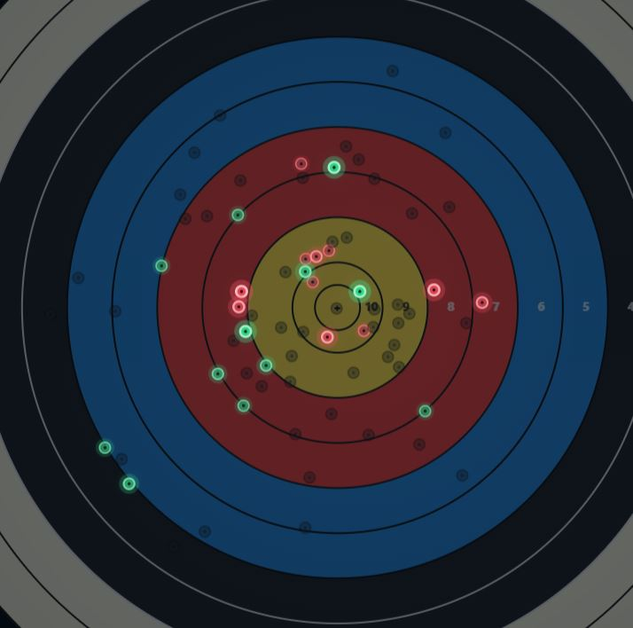

This overlay is useful when you want to see exactly which arrows contributed to the Ring Break Luck stat.

## Ring Break Luck and Luck Adjusted Score

**Ring Break Luck** estimates whether your score benefited from close line-cutters or was hurt by near-misses.

The app looks at the outer edge of each plotted arrow and compares it to nearby scoring ring boundaries. The important zone is roughly a **6 mm window** around a line:

- about 3 mm outside the higher scoring line,
- through the exact line touch,
- to about 3 mm inside the higher scoring line.

Arrows outside that close boundary window are treated as neutral because they are not meaningfully lucky or unlucky. A clean 10 well inside the line is not considered lucky; it is just a good shot. A clear 8 nowhere near the 9 line is not considered unlucky; it is simply an 8.

The score is shown on a 0-100 scale:

- **50** means neutral ring-break luck.
- **Above 50** means close scoring decisions were mostly favourable.
- **Below 50** means close scoring decisions were mostly unfavourable.
- Very close line-cutters push the value up more strongly.
- Very close near-misses push the value down more strongly.

**Luck Adjusted Score** uses the same close-boundary idea, but translates score-changing line breaks into an estimated score adjustment. It asks: *what might this score have looked like with neutral ring-break luck?*

These stats do not replace the official score. They are context tools that help explain whether the score was helped or hurt by close scoring margins.

## Performance Intelligence

Performance Intelligence is the app’s deeper session-analysis modal. It turns the plotted arrows into a statistical model of the session, then uses that model to estimate what similar repeats of the same shooting pattern might score.

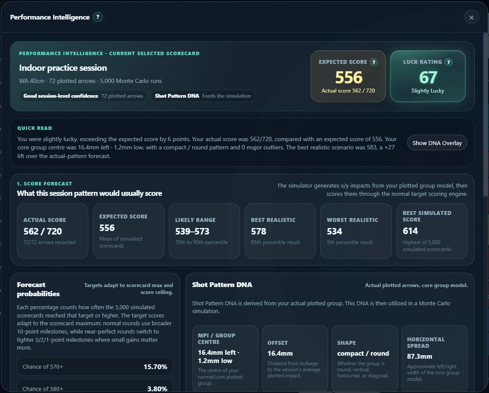

The app analyses the plotted group and builds **Shot Pattern DNA** from the session. This includes information such as group centre, spread, shape, offset, angle, ellipse behaviour, and outliers. That DNA is then used as the basis for a Monte Carlo simulation.

In Sagittarius, Monte Carlo means the app generates **5,000 simulated scorecards** from the plotted shot pattern. Each simulated scorecard creates realistic x/y arrow impacts from the same underlying pattern and scores them through the normal target scoring engine.

The modal can show:

- **Actual score** - the real recorded scorecard result.
- **Expected score** - the average score across the simulated scorecards.
- **Likely range** - the range where the same shot pattern commonly lands.
- **Best simulated score** - the highest result seen in that simulation batch.
- **Luck Rating** - where the actual score sits inside the simulated score distribution.
- **Score probabilities** - how often the simulated scorecards reached selected score targets.

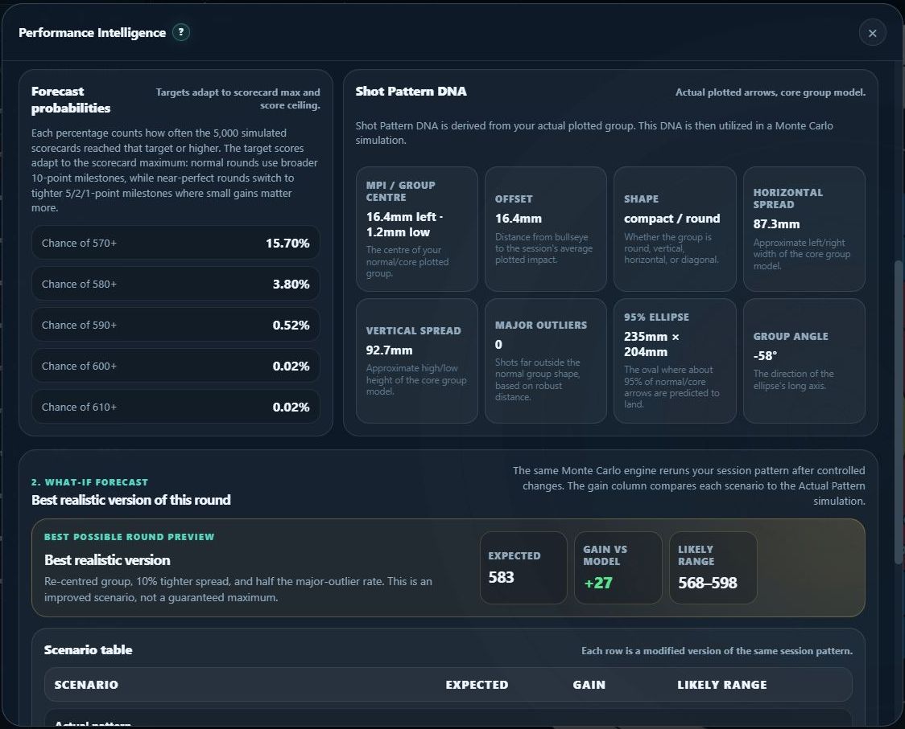

The **Luck Rating** in Performance Intelligence is different from Ring Break Luck. Ring Break Luck only looks at close line touches and near-misses. Intelligence Luck Rating looks at the whole simulated score distribution and asks whether the actual score converted unusually well or poorly for the overall shot pattern.

They can loosely correlate. A scorecard with many lucky line-cutters may also have a high Monte Carlo Luck Rating. But they are not the same stat: Ring Break Luck is boundary-specific, while Intelligence Luck Rating is whole-pattern score-conversion luck.

### What-if adjustments and projections

Performance Intelligence also runs controlled what-if scenarios using the same simulation engine.

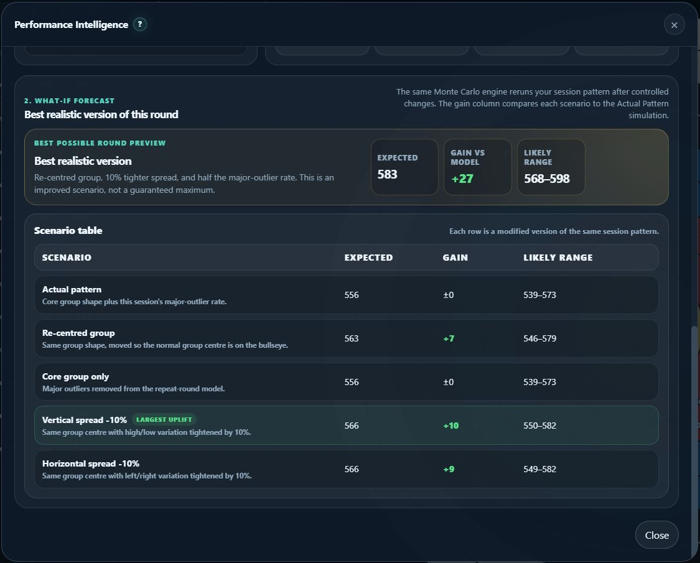

These projections can estimate how the expected score might change if the group were adjusted, such as:

- **re-centering the group**,
- **removing major outliers**,
- **reducing horizontal spread**,
- **reducing vertical spread**,
- or tightening the overall pattern.

The goal is not to predict the future perfectly. It is to show which changes would likely matter most if the same session pattern were improved.

## Timeline replay

Timeline mode lets you review how a session developed over time instead of only seeing the final group.

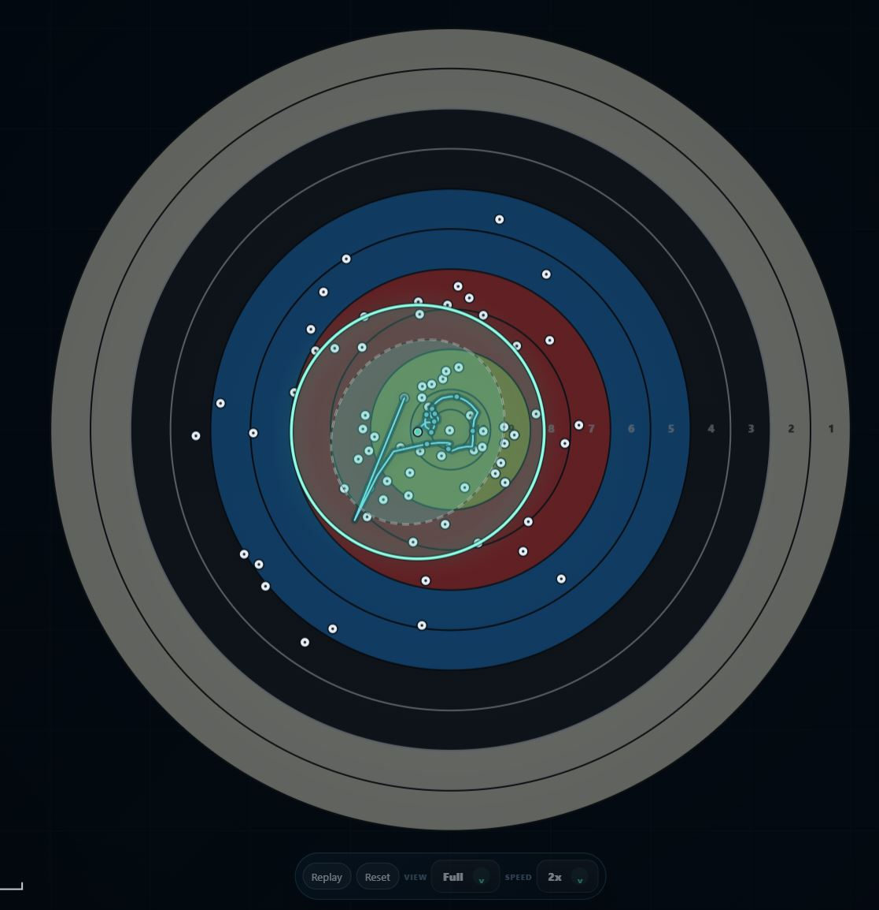

You can replay arrows progressively, inspect the order of shots, and see how the group builds across the scorecard. This is useful for reviewing whether a session started well and faded, whether a bad end changed the result, or whether the group shifted during the round.

End-based timeline views make it easier to compare ends and see how each end contributed to the final score.

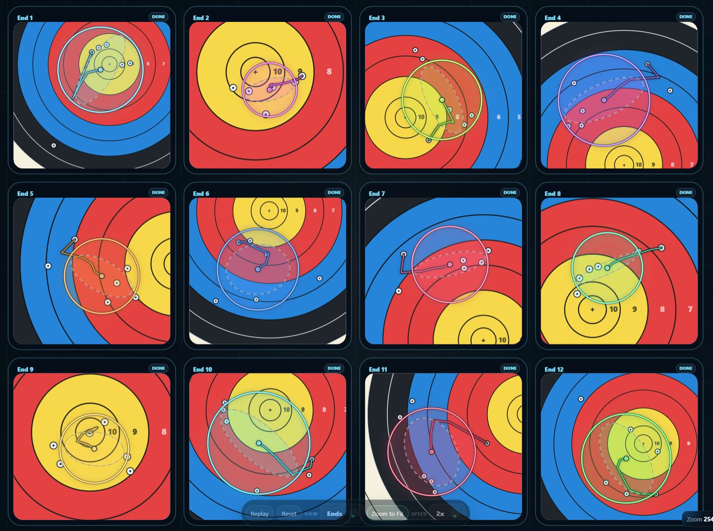

## Target swap

Changing the target face inside **Edit scorecard** is a permanent scorecard edit: the session is recategorised as that target face for scoring, PBs, records, and trends.

For temporary comparison, the viewport includes **Target swap**. This lets you view and rescore the same plotted arrows on another target face without changing the saved scorecard category. A warning appears over the viewport while Target swap is active, and the **Original target** option returns the view to the scorecard's actual target face.

## Extrapolated distance

The extrapolation tool projects the plotted arrow group to a different distance and recalculates the displayed score.

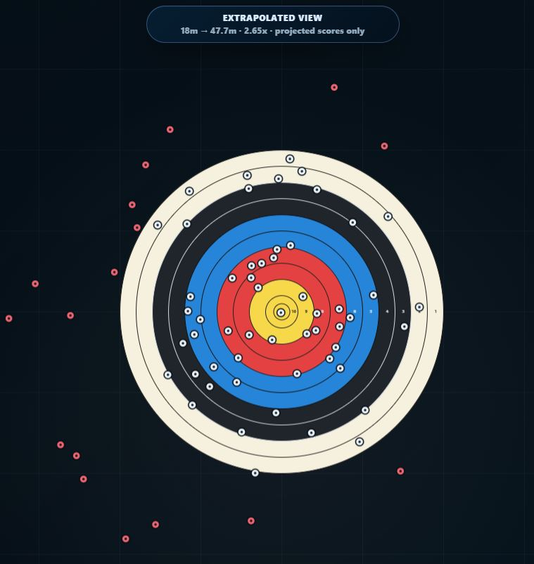

This is useful for exploring questions such as: *how would this group look at 70 m instead of 18 m?* or *what would happen if this pattern were scaled to a shorter distance?*

Extrapolation is an analysis tool only. It does not modify the original stored arrow positions.

## Trends, records, and arrow volume

The Trends view helps compare saved sessions over time. It is intended for reviewing practice history and spotting longer-term changes in performance.

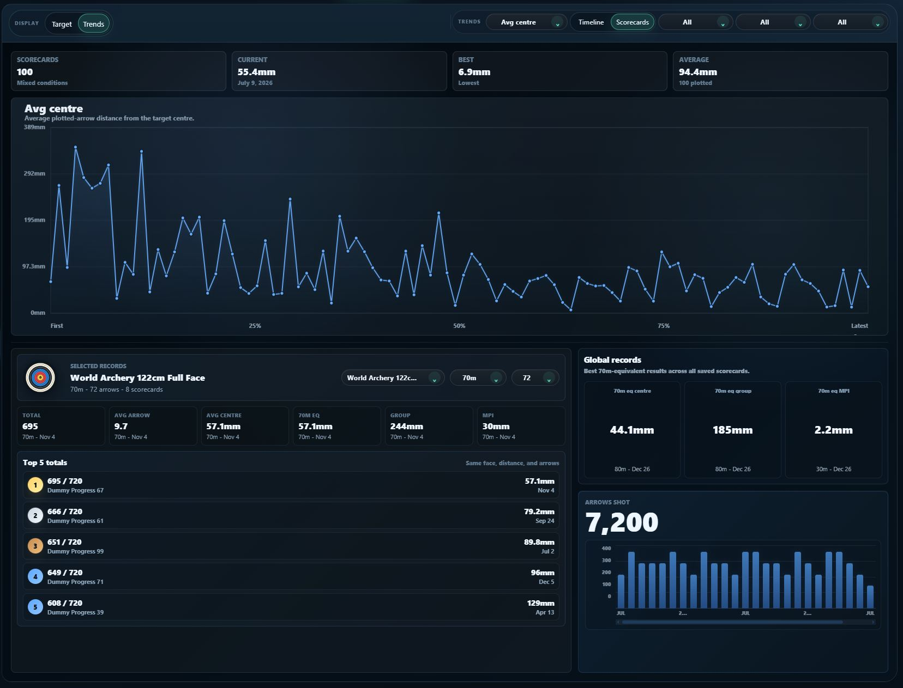

The graph can track different performance metrics, including:

- total score,
- average arrow,
- average centre,
- group size,
- MPI offset,
- and 70 m equivalent stats.

**70 m equivalent** stats scale distance-based measurements to a 70 m reference. This makes it easier to compare grouping-type metrics across sessions shot at different distances. For example, a group shot at 18 m can be scaled to a 70 m equivalent so it can be compared more meaningfully with longer-distance practice.

The records area can track best results across categories such as:

- target face,
- distance,
- arrow count,
- total score,
- average arrow,
- average centre,
- group size,
- MPI,
- and 70 m equivalent centre/group/MPI records.

The Trends view also includes an arrows-shot tracker. This currently gives a simple sense of shooting volume from saved scorecards, and is intended to be expanded in the future into a more detailed training-volume and workload feature.

## Saving, importing, and exporting scorecard data

Sagittarius can save scorecards in the browser and also export scorecard data as JSON.

JSON export/import is useful for:

- backing up scorecards,
- moving scorecards between browsers or computers,
- sharing scorecards for review,
- keeping practice data portable,
- and preserving custom target-face information used by a scorecard.

The Scorecard Manager lets you browse, load, manage, export, and import saved scorecards.

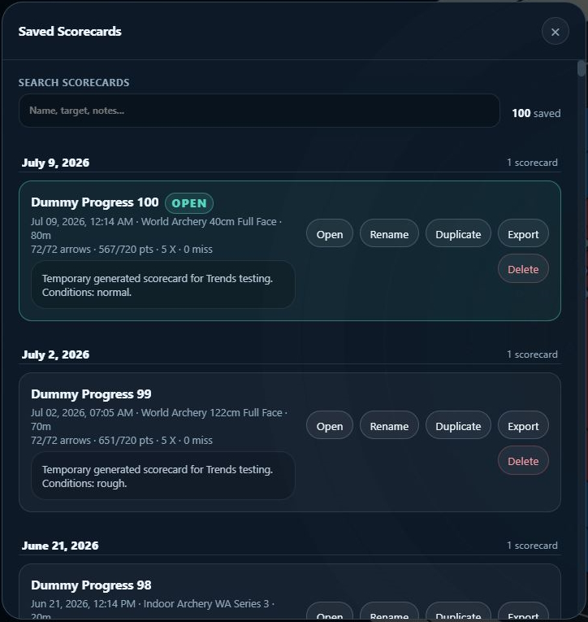

## Image export

Sagittarius can export clean target images for sharing, record keeping, or coaching review.

The export modal supports different export styles and layouts.

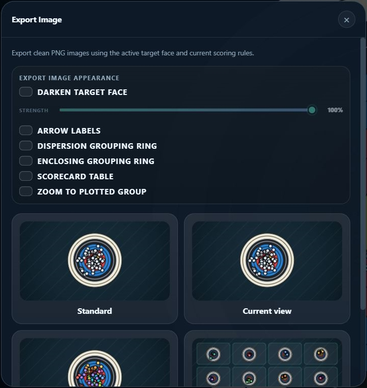

Standard view exports show the target and plotted arrows clearly.

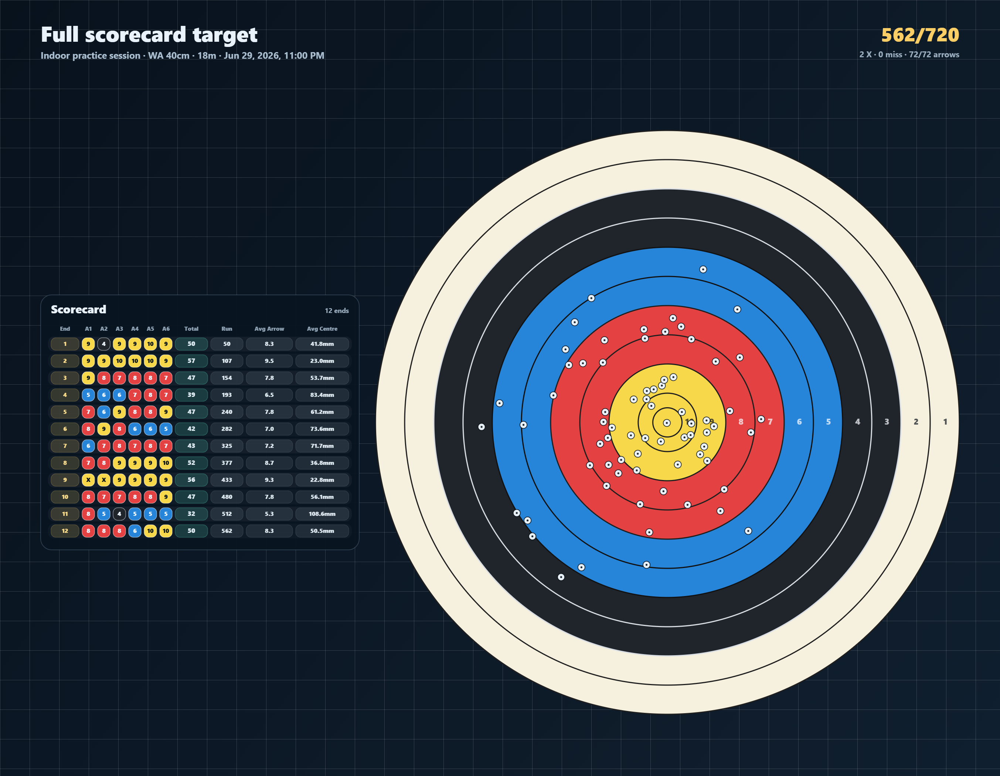

End-sheet exports lay out ends in a printable/shareable format.

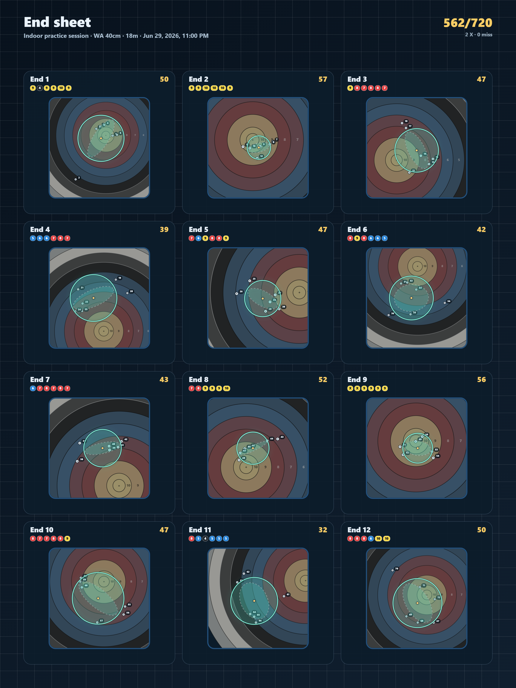

## Custom target faces

One of the most important features of Sagittarius is the ability to create and edit **custom target faces**.

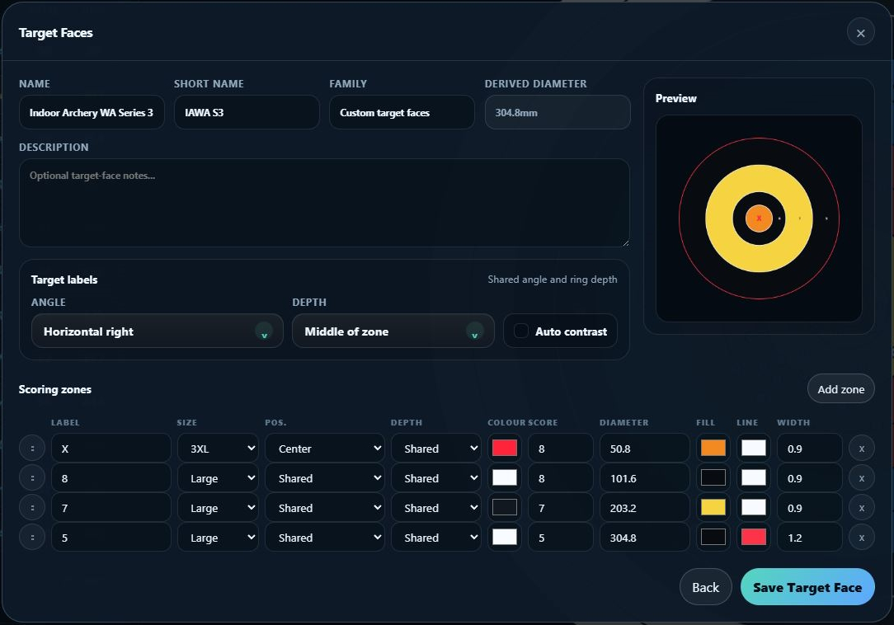

Many archery apps only support a fixed set of built-in target faces. Sagittarius is designed to be more flexible. Custom target faces make it possible to model different formats, practice faces, club faces, experimental faces, or target types that are not included by default.

This is especially useful for archers who practice with non-standard targets or want their scorecard and analysis tools to match the exact face they are using.

## Who it is for

Sagittarius is aimed at archers who want more than a paper scorecard. It is useful for:

- practice logging,
- plotted-arrow review,
- group and pattern analysis,
- score and record tracking,
- coaching discussions,
- sharing clean target images,
- and experimenting with custom target faces.

## Current status

This README reflects **Sagittarius v0.9.19**, including the accepted minimal scorecard header, independent target/distance metadata, Target swap comparison tool, automatic saving after Edit scorecard changes, the calendar-assisted Scorecard manager with compact saved-session cards and actual target-face previews, the polished top-toolbar order, the scorecard-first laptop layout, unified scorecard/analysis/notes scrolling, removal of the redundant top-left target viewport HUD, laptop layout refinements for manual scoring, analysis metric wrapping and thinner scrollbars, the handle-only compact viewport toolbar, compact-toolbar dropdown fixes, Trends panel height fixes, and narrow scorecard-table horizontal scrolling with stable columns, delayed fixed-size 6 x 2 manual-score wrapping, right-gapped sticky Total/Run columns with a clean edge mask, visible-pane-aligned Invert control, compact viewport-toolbar controls that wrap around the Display toggle without reserving empty second-row space, a manual-score strip that always grows to fit its controls, and smoothly responsive scorecard-table density that remains readable while retaining horizontal scrolling.

Sagittarius is currently a prototype browser-based app. Future versions may expand the analysis system, session summaries, custom target-face workflows, score history, arrows-shot tracking, desktop packaging, and mobile-friendly workflows.
